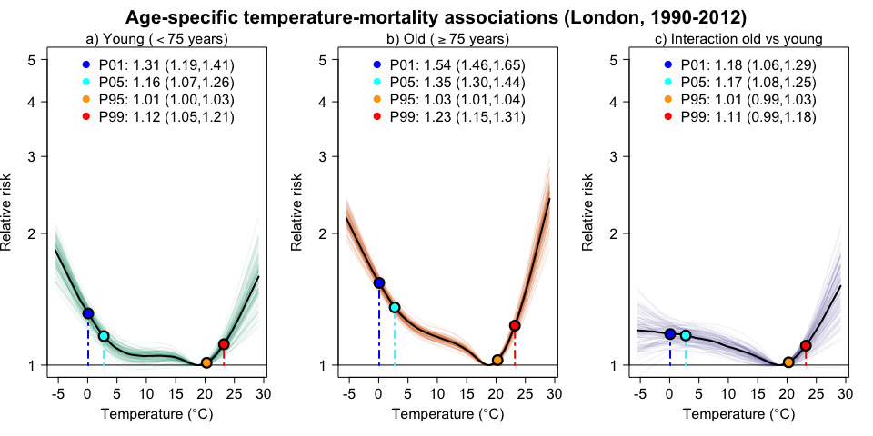

Interaction model with Bayesian DLNMs
================
Marcos Quijal-Zamorano
2025-09-23

## Summary

In this document, I present how to run an interaction model using
Bayesian distributed lag non-linear models (B-DLNMs) (Quijal-Zamorano et
al. 2024, 2025). This approach is especially useful for estimating
temperature-mortality associations across two (or more) population
groups, as it allows group-specific exposure-response function to be
estimated within a unified framework, while allowing formal assessment
of effect modification.

## Example

To illustrate the method, I use an application estimating the
age-specific associations between temperature and mortality in London
for the period 1990-2012. The original dataset is publicly available in
the literature (Vicedo-Cabrera, Sera, and Gasparrini 2019). For the
purposes of this document, the data have been pre-processed to focus on
two age categories: younger individuals ($<75$ years) and older
individuals ($\geq 75$ years).

## Analysis

### Model

First, load the libraries and the data.

``` r
#### LOAD LIBRARIES ############################################################

library(INLA) # inla
library(dlnm) # logknots
library(splines) # ns

#### LOAD DATA #################################################################

load("indata/data_obs_temp_mort.RData")
head(data_tempmort)
```

    ##         date year dow    tmean mort.00_74 mort.75plus
    ## 1 1990-01-01 1990 Mon 3.913589         76         144
    ## 2 1990-01-02 1990 Tue 5.547919        117         140
    ## 3 1990-01-03 1990 Wed 4.385564         98         147
    ## 4 1990-01-04 1990 Thu 5.431046         86         140
    ## 5 1990-01-05 1990 Fri 6.867855         99         137
    ## 6 1990-01-06 1990 Sat 9.232628         96         139

I define the exposure-lag-response using a typical DLNM configuration
commonly found in the literature.

``` r
#### SET VARIABLES DEFINING THE DLNM MODEL #####################################

# PARAMETERS DEFINING DLNMs
dlnm_var <- list(
  var_prc = c(10, 75, 90),
  var_fun = "ns",
  lag_fun = "ns",
  max_lag = 21,
  lagnk = 3)
```

I then create the cross-basis and other related variables needed for the
analysis.

``` r
# DEFINE THE EXPOSURE- AND LAG-RESPONSE FUNCTIONS
argvar <- list(fun = dlnm_var$var_fun,
               knots = quantile(data_tempmort$tmean, 
                                dlnm_var$var_prc/100, na.rm = TRUE),
               Bound = range(data_tempmort$tmean, na.rm = TRUE))
arglag <- list(fun = dlnm_var$lag_fun, 
               knots = logknots(dlnm_var$max_lag, nk = dlnm_var$lagnk))

# BUILD THE CROSS-BASIS
cb <- crossbasis(data_tempmort$tmean, lag = dlnm_var$max_lag, argvar, arglag)

# SAVE DIMENSIONS FOR REDUCING COEFFICIENTS
vx <- attr(cb, "df")[1]
vl <- attr(cb, "df")[2]
```

It is also necessary to include splines to smooth the seasonality term.

``` r
# BUILD THE BASIS WITH THE SEASONALITY TERM
seas <- ns(data_tempmort$date, 
           df = round(8 * length(data_tempmort$date) / 365.25))
```

The data are transformed from wide to long format, which is more
suitable for the single-model framework.

``` r
# WIDE TO LONG
data_long <- reshape(data_tempmort,
                     varying = c("mort.00_74", "mort.75plus"),
                     v.names = "mortality",
                     timevar = "age_group",
                     times = c("00_74", "75plus"),
                     direction = "long")
head(data_long)
```

    ##               date year dow    tmean age_group mortality id
    ## 1.00_74 1990-01-01 1990 Mon 3.913589     00_74        76  1
    ## 2.00_74 1990-01-02 1990 Tue 5.547919     00_74       117  2
    ## 3.00_74 1990-01-03 1990 Wed 4.385564     00_74        98  3
    ## 4.00_74 1990-01-04 1990 Thu 5.431046     00_74        86  4
    ## 5.00_74 1990-01-05 1990 Fri 6.867855     00_74        99  5
    ## 6.00_74 1990-01-06 1990 Sat 9.232628     00_74        96  6

Next, concatenate two copies of the cross-basis and the seasonality
basis. Because the days and exposures are the same for both groups,
duplicate these explanatory variables so they align with the new long
format.

``` r
# BIND TO COPIES OF cb AND seas TO FOLLOW THE SAME STRUCTURE OF data_long 
cb <- rbind(cb, cb)
seas <- rbind(seas, seas)
```

Unlike the `glm` function in the frequentist approach (TODO: check
this), the `inla` formula does not automatically remove rows containing
missing values. In this case, the NAs appear in the first 21 rows of the
cross-basis, since temperatures prior to the start of the study period
are not available. These rows must therefore be removed before running
the analysis.

``` r
# REMOVE NAs (inla FUNCTION DOES NOT REMOVE THEM)
ind_na <- apply(cb, 1, function(x) any(is.na(x)))

data_long <- data_long[!ind_na,]
cb <- cb[!ind_na,]
seas <- seas[!ind_na,]
```

Arrange the data for the model: change the name of the cross-basis
columns, and add a variable categorizing age groups.

``` r
# ARREGEMENTS FOR THE MODEL
colnames(cb) <- paste0("cb", 1:ncol(cb))
data_long$age_group <- factor(data_long$age_group)
```

Run the interaction model in R-INLA:

``` r
# RUN INTERACTION MODEL
model <- 
  inla(mortality ~ cb*age_group + factor(dow)*age_group + seas*age_group,
       data = data_long, family = "poisson", 
       control.compute = list(config = TRUE))
```

### Model output

After fitting the model, create a list of coefficients from which
samples will be drawn from the joint posterior distribution. Note that
the age group `00_74` serves as baseline. To obtain the coefficients for
the `75plus` group, extract the interaction terms between the
cross-basis and the `75plus` age group.

``` r
# CREATE A LIST OF PART OF SAMPLE WE ARE INTERESTED (THE CB AND INTERACTION)
selection_names <- c(colnames(cb), paste0(colnames(cb), ":age_group75plus"))
selection_list <- as.list(rep(1, length(selection_names)))
names(selection_list) <- selection_names
```

Draw samples from the joint posterior distribution and combine them to
obtain the estimates for both age groups and the interaction.

``` r
# EXTRACT THE ENSAMBLE OF SAMPLE COEFFICIENTS FROM THE JOINT POSTERIOR 
# DISTRIBUTIONS
coef <- inla.posterior.sample(100, model, selection = selection_list)

# INITIALIZE OBJECT TO SAVE THE OUTPUTS
coefsim_age <- list()

# ARRANGE THE COEFFICIENTS OF THE CB
coefsim_age[["00_74"]] <- sapply(coef, function(x) {
  sapply(colnames(cb), function(coef_name) {
    x$latent[paste0(coef_name, ":1"),]
  })
})

coefsim_age[["75plus"]] <- sapply(coef, function(x) {
  sapply(colnames(cb), function(coef_name) {
    x$latent[paste0(coef_name, ":1"),] + 
      x$latent[paste0(coef_name, ":age_group75plus:1"),]
  })
})

coefsim_age_interaction <- sapply(coef, function(x) {
  sapply(colnames(cb), function(coef_name) {
      x$latent[paste0(coef_name, ":age_group75plus:1"),]
  })
})
```

Reduce coefficients for the cumulative exposure-response function. This
is an optional step, as cumulative relative risks (RRs) - not the
coefficients- can be calculated by summing RRs across lags. In addition,
deriving impacts from the full exposure-lag-response function could
potentially provide more accurate impact measures. However, I present
the reduction process developed elsewhere to derive the coefficients of
the cumulative exposure-response function (Gasparrini and Armstrong
2013) . This procedure involves calculating a dimension-reducing matrix
M for the cumulative overall association:

$$
M_{[c]} = \mathbf{1}_{(L+1)}^\top \, C \otimes \mathbf{I}_{(v_x)} 
$$

``` r
# Uni-dimensional basis for lags
C <- onebasis(x = 0:dlnm_var$max_lag,
              fun = dlnm_var$lag_fun,
              knots = logknots(dlnm_var$max_lag, nk = dlnm_var$lagnk),
              intercept = TRUE)

# Row vector of ones of length (L+1)
ones <- matrix(1, nrow = 1, ncol = dlnm_var$max_lag + 1)

# Matrix multiplication
product <- ones %*% C

# Identity matrix of size vx
I_vx <- diag(vx)

# Compute dimension-reducing matrix
M <- I_vx %x% product

# (Remove temporary datasets)
rm(C, ones, product, I_vx, vx, vl)

# Apply the reduction
coefsim_age[["00_74"]] <- 
  apply(coefsim_age[["00_74"]], 2, function(x) M %*% x)
coefsim_age[["75plus"]] <- 
  apply(coefsim_age[["75plus"]], 2, function(x) M %*% x)
coefsim_age_interaction <- 
  apply(coefsim_age_interaction, 2, function(x) M %*% x)
```

### Plot results

Finally, plot the cumulative exposure-response function for the two age
groups and its interaction.

``` r
# ADD THE INTERACTION TO coefsim_age OBJECT to plot it in the loop
coefsim_age$interaction <- coefsim_age_interaction
  
# DEFINE VARIABLES FOR AGE GROUPS AND PLOTS
# Age groups
age_parameters <- data.frame(
  response = c("mort.00_74", "mort.75plus", "NA"),
  groups = c("00_74", "75plus", "interaction"),
  col_est = c("#1B9E77", "#D95F02", "#7570B3"))
n_groups <- 3

# Title plot
title_plot <- list(
  expression("a) Young ("< 75*" years)"),
  expression("b) Old (">= 75*" years)"),
  expression("c) Interaction old vs young"))

# Other varaibles for plotting
main <- NULL
title <- NULL
perc <- c(1, 5, 95, 99)/100
col <- c("blue", "cyan", "orange", "red")
ymax <- 5

# INITIALIZE PLOT
nrow.fig <- 1; ncol.fig <- 3
layout(matrix(seq(ncol.fig * nrow.fig), nrow = nrow.fig, byrow = TRUE))
par(mex = 1, mgp = c(3, 1, 0), las = 1, oma = c(0, 0, 0, 0))

for(iter in 1:n_groups) {
  
  # TEMPERATURES TO PLOT IN THE X-AXIS
  predper <- c(seq(0, 1, 0.1), 2:98, seq(99, 100, 0.1))
  tper <- quantile(data_tempmort$tmean, predper / 100)

  # GENERATE THE CROSSBASIS FOR TEMPERATURES
  bcen <- onebasis(
    x = tper, 
    fun = argvar$fun, 
    knots = argvar$knots, 
    Boundary.knots = argvar$Bound)
  
  # CALCULATE THE SAMPLE OF RELATIVE RISKS
  rrsim <- bcen %*% coefsim_age[[iter]]
  
  # LOCATE POSITION OF THE TEMPERATURE WITH MINIMUM RISK
  immt <- which.min(rowMeans(rrsim))
  coef_mmt <- rrsim[immt,] 
  
  # BUILD A MATRIX REPLICATING THE COEFFICIENTS IN THE MMT
  centring_matrix <- 
    matrix(rep(coef_mmt, length(tper)), 
           nrow = length(tper), byrow =TRUE)
  
  # CENTER RISK IN THE MMT
  rrsim <- exp(rrsim - centring_matrix)
  
  # GET MIN, MEDIAN AND MAX OF RRs TO PLOT THEM
  rrmin <- apply(rrsim, 1, min)
  rrmax <- apply(rrsim, 1, max)
  rrmedian <- apply(rrsim, 1, median)
  
  # FIND SPECIFIC TEMPERATURES AND RISKS TO PLOT IN THE LEGEND
  ind <- (tper %in% quantile(data_tempmort$tmean, perc))
  
  Tplot <- tper[ind]
  RRplot <- rrmedian[ind]
  RRplot_min <- rrmin[ind]
  RRplot_max <- rrmax[ind]
  
  # EMPTY PLOT
  plot(tper, rrsim[,1], type = "n",
       xlab = expression(paste("Temperature (", degree, "C)")),
       ylab = "Relative risk", ylim = c(1.000, ymax), 
       log = "y", cex.lab = 1.5, cex.axis = 1.5)
  title(title_plot[[iter]], line = 0.65, font.main = 1, cex.main = 1.5)
  
  # PLOT SAMPLE OF RR
  for(i in 1:100){
    lines(tper, rrsim[,i], col = age_parameters$col_est[iter], lwd = 0.1)
  }
  
  # PLOT MEDIAN RR
  lines(tper, rrmedian, col = "black", lwd = 2)
  
  # OTHER PLOTTING ASPECTS
  abline(h = 1)

  # PLOT LINES AND RR FOR THE SPECIFIC TEMPERATURES OF INTEREST
  for(i in 1:length(col)){
    lines(c(Tplot[i], Tplot[i]), c(1, RRplot[i]), 
          lty = 4, col = col[i], lwd = 2)
  }
  rm(i)
  
  points(Tplot, RRplot, col = "black", pch = 21, 
         cex = 1.5*1.5, bg = col, lwd = 1.5*1.5)
  
  legend("top", paste0("P", sprintf("%02d", perc*100), ": ",
                       formatC(RRplot, digits = 2, format = "f", flag="0"), " (",
                       formatC(RRplot_min, digits = 2, format = "f", flag="0"), ",",
                       formatC(RRplot_max, digits = 2, format = "f", flag="0"), ")"), 
         col = col, pch = 19, box.lty = 0, cex = 1.5, bg = "transparent")
  
}

mtext("Age-specific temperature-mortality associations (London, 1990-2012)", 
      side = 3, outer = TRUE, line = -2.2, cex = 1.3, font = 2)
```

<div class="figure" style="text-align: center">


<p class="caption">

Age-specific (\<75 and ≥75 years) temperature-mortality associations in
London during 1990-2012, estimated using an interaction model and
Bayesian distributed lag non-linear models (B-DLNMs).
</p>

</div>

*The plots show the relative risk of mortality associated with daily
temperatures, accumulated across the lag period. Thick lines represent
the point estimates (median values), while the fine coloured lines
represent 100 posterior samples used to propagate uncertainty in the
temperature-mortality associations. Blue, cyan, orange, red and brown
dots indicate the 1st, 5th, 95th, 99th and 100th percentiles of the
observed temperature distribution, respectively. The legend displays the
point estimates and ranges (from the 100 samples) of the relative risks
at selected temperatures. Panels a) and b) show the
temperature-mortality association for the \<75 years and ≥75 age groups,
respectively. Panel c) shows the relative risk ratio (older vs younger)
across the temperature range, capturing the interaction effect estimated
from the interaction model.*

### Bibliography

<div id="refs" class="references csl-bib-body hanging-indent"
entry-spacing="0">

<div id="ref-Gasparrini2013" class="csl-entry">

Gasparrini, Antonio, and Ben Armstrong. 2013. “Reducing and
Meta-Analysing Estimates from Distributed Lag Non-Linear Models.” *BMC
Medical Research Methodology* 13 (1).
<https://doi.org/10.1186/1471-2288-13-1>.

</div>

<div id="ref-quijal-zamorano2024" class="csl-entry">

Quijal-Zamorano, Marcos, Miguel A Martinez-Beneito, Joan Ballester, and
Marc Marí-Dell’Olmo. 2024. “Spatial Bayesian Distributed Lag Non-Linear
Models (SB-DLNM) for Small-Area Exposure-Lag-Response Epidemiological
Modelling.” *International Journal of Epidemiology* 53 (3).
<https://doi.org/10.1093/ije/dyae061>.

</div>

<div id="ref-quijal-zamorano2025" class="csl-entry">

———. 2025. “Spatial Bayesian Distributed Lag Non-Linear Models with
R-INLA.” *International Journal of Epidemiology* 54 (4).
<https://doi.org/10.1093/ije/dyaf120>.

</div>

<div id="ref-vicedo-cabrera2019" class="csl-entry">

Vicedo-Cabrera, Ana M., Francesco Sera, and Antonio Gasparrini. 2019.
“Hands-on Tutorial on a Modeling Framework for Projections of Climate
Change Impacts on Health.” *Epidemiology* 30 (3): 321–29.
<https://doi.org/10.1097/ede.0000000000000982>.

</div>

</div>
